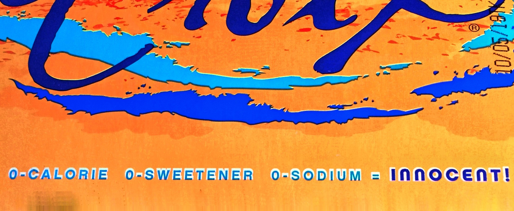

## Sound the alarm--a beloved brand has switched over to the dark side.

La Croix, the ubiquitous sparkling water product, has gotten a lot of press in the past few years for its remarkable success.  The fact that this success is built on [fervent popularity with millenials](https://www.theguardian.com/lifeandstyle/2018/jul/04/la-croix-fizzy-flavoured-water) and a marketing approach that relies heavily on [social media](https://www.ion.co/lacroix-sparkles-millennials-thanks-influencer-marketing) has positioned the brand as a symbol of savviness when it comes to leveraging current cultural trends and using that relevance to sell its product.  When the fabulous [La Croix Boi](https://www.youtube.com/watch?v=LB_YWGuYGn4) skates across the dance floor, you know the brand has entered our cultural consciousness on a deep level.

All of which makes it so disappointing to see a notable change in La Croix's packaging:

There it is, tucked quietly onto the edge of the cardboard case like a little stock-ticker at the bottom of your screen.  And then when you open the package--voila! the same message scrolling across the bottom of every can.  It was so small I didn't notice it until I got home from the grocery store.  A quick investigation shows that the brand has gone whole-hog on some of its products:

Yikes.  That's a lot of body nonsense on one package.

La Croix has never really been a body-positive or even body-agnostic product. As far as I can tell, they have always leveraged a 'healthy' and 'natural' image, and until this recent marketing change their cans said 'no calories, no artificial sweetener' on them.  Fine.  But the choice to describe their product as <em>innocent</em> is a choice to enter the toxic swamp of body nonsense.  If La Croix is innocent, then other food and drink is guilt-ridden.  If 'zero calories' is 'healthy,' then the enjoyment of something containing calories is not.  If everyone buying sparkling water needs to be told exactly how many calories must be burned in order to lose a pound of body weight under the label of 'fitness'--you get the idea.  La Croix is selling brightly-colored cans of sparkly <strong>bullshit</strong>.

So there you have it, La Croix has joined the dark side.  No longer will flirty cans of <em>pamplemousse</em> sit in my fridge. My only question is how the brand's celebrity amongst supposedly politically-conscious millenials will be affected.  My hunch is that the dramatic turn toward body-shaming messages will not have a large impact on the brand's success either way.  But as the body-positive movement fights for more real-estate in our politically-charged culture, I wonder if social-media darlings like La Croix will be held accountable for their messages.
